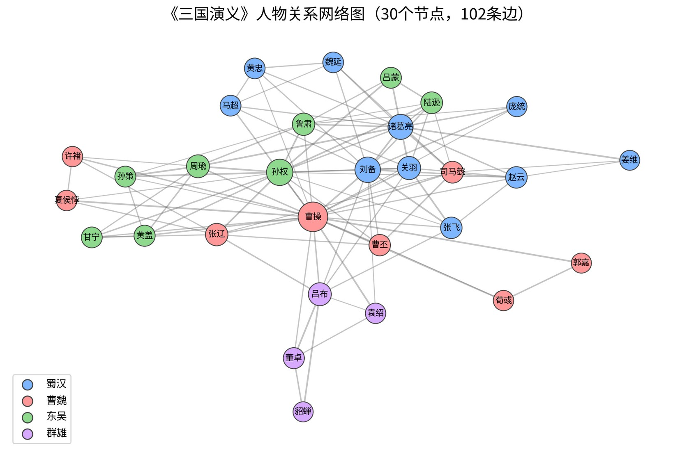
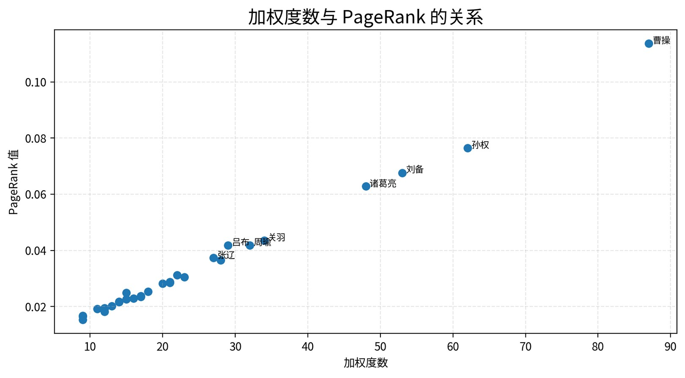

# 基于图结构与 PageRank 算法的《三国演义》人物关系网络分析

本项目是数据结构课程科研引领训练的作品成果，围绕《三国演义》人物关系数据，使用 C++ 构建加权无向图，并通过普通度数、加权度数和加权 PageRank 算法分析人物在关系网络中的结构重要性。

项目包含完整的 C++ 实现、数据文件、结果输出、可视化图片、PPT 汇报材料和研究报告，可用于课程展示、实验说明和后续扩展分析。

## 项目特点

- 使用邻接表存储人物关系网络，符合数据结构课程中图结构的典型实现方式。
- 将人物关系建模为加权无向图，边权重表示人物关系强度。
- 实现考虑边权重的 PageRank 算法，使重要性计算更贴合人物关系强弱。
- 自动输出度数统计结果和 PageRank 排名结果，便于论文、报告和 PPT 引用。
- 配套研究报告、PPT 和可视化图片，形成较完整的课程项目材料。

## 目录结构

```text
PageRank/
|-- data/
|   |-- character_edges_simple.csv
|   |-- character_edges_detailed.csv
|   |-- character_nodes.csv
|   |-- README_dataset.md
|-- src/
|   |-- main.cpp
|-- output/
|   |-- degree_result.txt
|   |-- pagerank_result.txt
|-- image/
|   |-- 人物关系网络图.png
|   |-- 加权度数与PageRank的关系.png
|   |-- PageRank前10名人物-1.png
|   |-- PageRank前10名人物-2.png
|-- sanguo_pagerank_report_ppt.pptx
|-- 研究报告.docx
|-- 研究报告.pdf
|-- README.md
|-- run.bat
```

## 快速开始

### 环境要求

- Windows 操作系统
- 支持 C++17 的 `g++`
- 命令行可以正常调用 `g++`

### 一键运行

在项目根目录下运行：

```bat
run.bat
```

`run.bat` 会自动完成编译和运行：

```bat
g++ src/main.cpp -o sanguo_pagerank.exe -std=c++17
sanguo_pagerank.exe
```

如果命令行显示中文乱码，可以先执行：

```bat
chcp 65001
```

## 数据说明

主程序默认读取：

```text
data/character_edges_simple.csv
```

CSV 数据格式为：

```csv
source,target,weight
刘备,关羽,5
刘备,张飞,5
```

字段含义如下：

| 字段 | 含义 |
| --- | --- |
| `source` | 关系起点人物 |
| `target` | 关系终点人物 |
| `weight` | 关系强度，数值越大表示人物关系越紧密 |

程序会将每条记录视为无向关系。例如 `刘备,关羽,5` 表示刘备与关羽之间存在一条权重为 `5` 的无向边。

## 核心程序说明

核心代码位于：

```text
src/main.cpp
```

`main.cpp` 主要完成以下工作：

1. 读取 `data/character_edges_simple.csv` 中的人物关系数据。
2. 将人物名称映射为整数编号，便于使用数组和邻接表存储。
3. 使用 `vector<vector<Edge>>` 建立加权无向图。
4. 统计人物节点数量、关系边数量、普通度数和加权度数。
5. 使用加权 PageRank 算法计算人物重要性。
6. 将结果写入 `output/degree_result.txt` 和 `output/pagerank_result.txt`。

程序中的主要结构如下：

| 名称 | 作用 |
| --- | --- |
| `struct Edge` | 表示邻接表中的一条边，包含邻接点编号和边权重 |
| `class Graph` | 封装人物节点、邻接表、边数统计、度数统计等图操作 |
| `loadGraphFromCsv` | 从 CSV 文件读取数据并构建图 |
| `calculateWeightedPageRank` | 执行加权 PageRank 迭代计算 |
| `saveDegreeResult` | 输出普通度数和加权度数统计结果 |
| `savePageRankResult` | 输出 PageRank 参数、收敛信息和排名结果 |

## 算法设计

### 图建模

本项目将人物关系网络抽象为加权无向图：

- 人物：图中的节点
- 人物关系：图中的边
- 关系强度：边的权重

邻接表结构如下：

```cpp
vector<vector<Edge>> adj;
```

这种结构适合存储人物关系网络这类相对稀疏的图，能够较方便地遍历某个人物的所有邻居。

### 普通度数

普通度数表示一个人物直接连接的不同人物数量：

```text
degree(u) = 与 u 直接相连的节点数量
```

该指标主要反映人物的直接关系范围。

### 加权度数

加权度数表示一个人物所有邻接边权重之和：

```text
weightedDegree(u) = sum(weight(u, v))
```

该指标不仅考虑关系数量，也考虑关系强度。

### 加权 PageRank

传统 PageRank 通常按照出边数量平均分配贡献。本项目在人物关系网络中引入边权重，使强关系具有更高贡献比例。

对于节点 `u` 到邻居 `v` 的贡献，使用如下比例：

```text
weight(u, v) / sumWeight(u)
```

其中 `sumWeight(u)` 表示节点 `u` 所有邻接边权重之和。

PageRank 参数设置：

| 参数 | 取值 |
| --- | --- |
| damping factor | `0.85` |
| max iteration | `100` |
| epsilon | `1e-8` |

## 输出结果

程序运行后会生成：

```text
output/degree_result.txt
output/pagerank_result.txt
```

`degree_result.txt` 包含人物节点数量、关系边数量、每个人物的普通度数和加权度数。

`pagerank_result.txt` 包含图基本信息、PageRank 参数、实际迭代次数、最终变化量和人物 PageRank 排名。

当前数据运行结果概览：

| 指标 | 结果 |
| --- | --- |
| 人物节点数量 | `30` |
| 关系边数量 | `102` |
| PageRank 实际迭代次数 | `28` |
| PageRank 最终变化量 | `9.691789e-009` |

PageRank 前 5 名人物：

| 排名 | 人物 | PageRank |
| --- | --- | --- |
| 1 | 曹操 | `0.11362478` |
| 2 | 孙权 | `0.07646567` |
| 3 | 刘备 | `0.06761510` |
| 4 | 诸葛亮 | `0.06280482` |
| 5 | 关羽 | `0.04353323` |

## 可视化结果

项目中的 `image` 文件夹保存了用于 PPT 和研究报告的可视化结果。





## PPT 与研究报告

本项目已整理了课程展示材料：

- `sanguo_pagerank_report_ppt.pptx`：课程汇报 PPT，适合用于课堂展示。
- `研究报告.docx`：研究报告 Word 版本，便于继续修改。
- `研究报告.pdf`：研究报告 PDF 版本，适合提交和展示。

PPT 和研究报告可以重点围绕以下逻辑展开：

1. 研究背景：从文学人物关系网络切入，引出图结构建模。
2. 数据建模：说明人物、关系、权重分别如何对应图中的节点、边和边权。
3. 算法实现：介绍邻接表、度数统计、加权 PageRank 的计算过程。
4. 实验结果：展示度数排名、PageRank 排名和可视化图。
5. 结果分析：对比普通度数、加权度数和 PageRank，说明人物局部关系与全局影响力的差异。

## 适合报告中强调的结论

- 曹操、孙权、刘备、诸葛亮等人物在网络中具有较高 PageRank，说明他们不仅关系较多，也与其他重要人物联系紧密。
- 普通度数能够反映人物的直接关系规模，但无法完全体现相邻人物的重要性。
- 加权度数能够补充关系强度信息，适合分析人物关系的紧密程度。
- 加权 PageRank 综合考虑关系强度和网络结构，更适合衡量人物在整体关系网络中的影响力。

## 后续可扩展方向

- 使用更完整的人物关系数据集，扩展节点和边的规模。
- 增加社群发现算法，分析魏、蜀、吴等阵营结构。
- 将结果导出为图可视化工具支持的格式，例如 Gephi 的 CSV/GEXF。
- 加入中心性指标对比，例如介数中心性、接近中心性和特征向量中心性。
